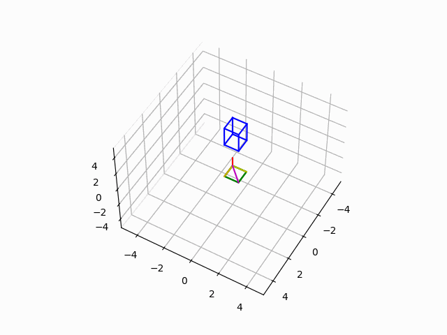

# Linear_Algebra_Python_Demo
Overview
The objective of this project is to just be a demo of projecting 3D objects in R3 to a plane in R3 while at the same time rotating that object around an axis. This project demonstrates some of what I have learned in my course in Linear Algebra, namely linear transformations, projections, change of basis, and creating orthonormal basises. While working on this project, I was teaching myself how to use python, numpy, and matplotlib all at the same time on the fly. because of this, the development process was quite slow, but very worth while since it has taught me alot. 

The best and most up to date version is in the file 3dProjectionSim.py
Going into the file, you can modify the settings to change:
the object dimensions    
plane of the projection
rotation speed and direction.

The yellow axis are the basis vectors of the plane, the blue object is 3d, the green object is the projection, and magenta is the axis of rotation.

I have included an older version of this project just to show some of the learning process and different ways of displaying the projection.

